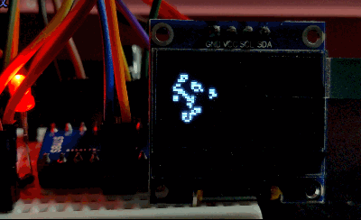

## Cellink
The Game Of Life emulator on `stm8s003f3` chip.

## Peripheral
- SSD1306 OLED (I2C 128x64)

## Wires
- (STM8) PB4 <-> (OLED) SCL
- (STM8) PB5 <-> (OLED) SDA
- (OLED) VCC <-> 3V3
- (OLED) GND <-> GND

## Build
- Need IAR STM8 compile system.
- Use vscode [EIDE](https://github.com/github0null/eide) to build this projet.
